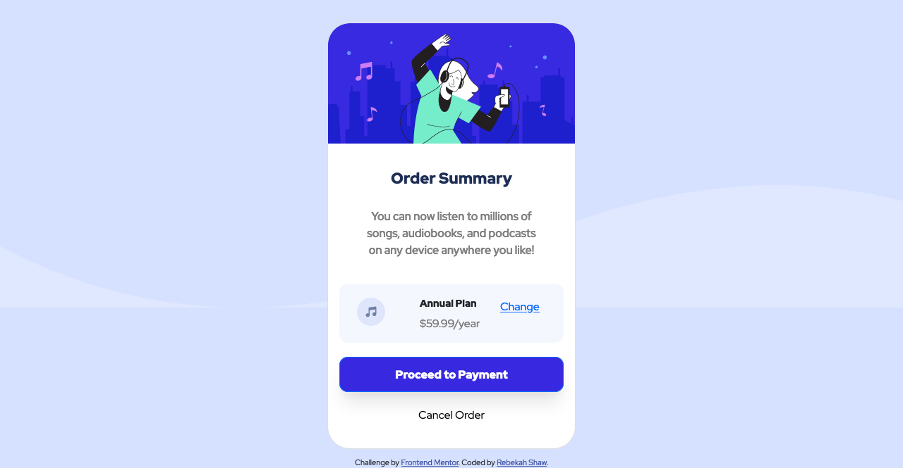

# order-summary-component-main

# Frontend Mentor - Order summary card solution

This is a solution to the [Order summary card challenge on Frontend Mentor](https://www.frontendmentor.io/challenges/order-summary-component-QlPmajDUj). Frontend Mentor challenges help you improve your coding skills by building realistic projects. 

## Table of contents

- [Overview](#overview)
  - [The challenge](#the-challenge)
  - [Screenshot](#screenshot)
  - [Links](#links)
- [My process](#my-process)
  - [Built with](#built-with)
  - [What I learned](#what-i-learned)
  - [Continued development](#continued-development)
  - [Useful resources](#useful-resources)
- [Author](#author)

### The challenge

Users should be able to:

- See hover states for interactive elements

### Screenshot

### Desktop Site

### Mobile Site

### Links

- Solution URL: [Solution](https://github.com/rebekahshaw92/order-summary-component-main)
- Live Site URL: [Live Site](https://rebekahshaw92.github.io/order-summary-component-main/)

## My process

### Built with

- Semantic HTML5 markup
- CSS custom properties
- Bootstrap 5
- Sass

### What I learned

As a result of this challenge I learned more about how css media queries and bootstrap cards work. 

### Continued development

I would like to continue learn more about bootstrap as there are so many areas that I have yet to discover. 

### Useful resources

- [Bootstrap](https://getbootstrap.com) - This site helped me to learn everything I need to know about bootstrap

## Author

- Website - [Rebekah Shaw](https://rebekahshaw.com)
- Frontend Mentor - [@rebekahshaw92](https://www.frontendmentor.io/profile/rebekahshaw92)
- Twitter - [@x_BeckyBoo_x](https://www.twitter.com/x_BeckyBoo_x)

